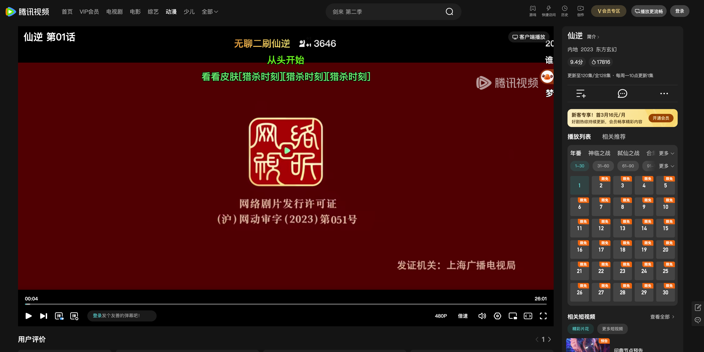
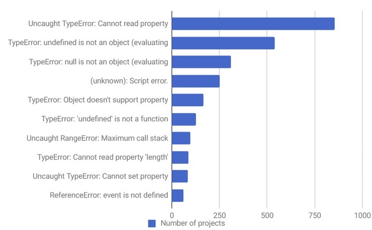
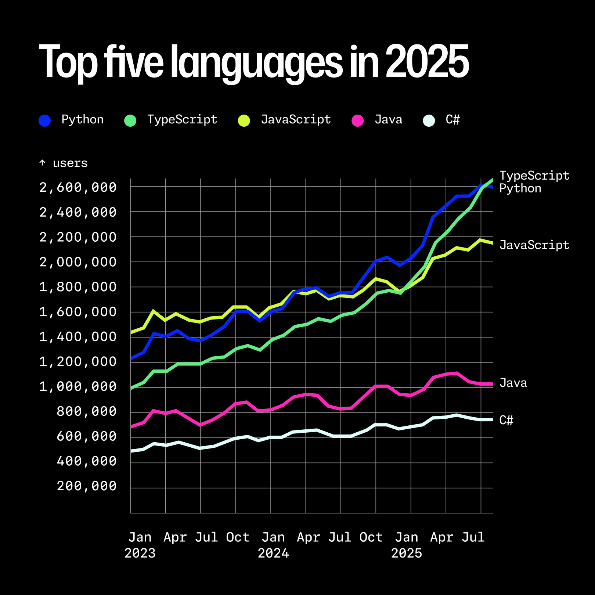

# 前端技术分享

---

# 什么是前端?

前端（Front-end） 指的是互联网产品中直接面向用户的部分。它是用户能看到、听到、触摸到并进行交互的界面总和，也被称为“客户端”。

## 前端的应用领域

- Web

- 移动端 App

- 桌面端 App

- 小程序

- CLI(命令行界面)

- 游戏

管理系统

AI - ChatGPT

AI - 豆包

官网 - Apple

电商平台 - 淘宝

娱乐/流媒体 - 短视频

娱乐/流媒体 - 直播

娱乐/流媒体 - 影视平台

移动端 App - React Native（国际）

- Facebook
- Instagram
- Microsoft Office
- Microsoft Outlook
- Microsoft Teams
- Amazon Shopping
- Shopify
- Discord
- Tesla

https://reactnative.dev/showcase

移动端 App - React Native（国内）

- 京东
- 百度

移动端 App - Lynx

- 抖音
- 今日头条
- 西瓜视频
- 懂车帝
- 皮皮虾
- 飞书
- 番茄小说

主要是字节产品的 App 中。

桌面端 - Electron

- Visual Studio Code
- Figma
- Postman
- Notion
- Microsoft Teams
- Slack
- 飞书
- 钉钉
- 抖音客户端

https://www.electronjs.org/apps

桌面端 - Tauri

- [得物商家客服](https://m.duomai.com/app/wuliu/home)

- [Clash Verge](https://github.com/clash-verge-rev/clash-verge-rev)

生态在发展，但没 Electron 那么流行。

小程序

[2024 微信小程序年度盘点：用户规模达 9.49 亿，月人均使用近 70 次。](https://www.thepaper.cn/newsDetail_forward_29602559)

小程序数量太多了，这里列举 2 个。

肯德基

瑞幸咖啡

CLI(命令行界面)

Claude Code

CLI(命令行界面)

[Gemini CLI](https://github.com/google-gemini/gemini-cli)

---

# 前端技术栈

- HTML
- CSS
- JavaScript
- TypeScript
- React/Vue
- Next.js/Nuxt.js
- Tailwind CSS
- Vite
- Shadcn UI/Nuxt UI

---

# HTML + CSS

### HTML 定义了网页内容的含义和结构。

- 参考 https://developer.mozilla.org/zh-CN/docs/Web/HTML

 

### CSS 定义了网页内容的样式和布局。

- 参考 https://developer.mozilla.org/zh-CN/docs/Web/CSS

 

这里推荐直接学习 [Tailwind CSS](https://tailwindcss.com/)。

---

# TypeScript

在大型项目中，一个类型“小改动”可能会导致很多处代码需要跟着调整，而这些需要调整的地方在“小改动”前后可能不会有任何报错提示，开发者只能靠肉眼排查，很难且容易遗漏。
我们使用 Typescript 的主要目的就是【类型安全】（type-safe），借助类型声明避免程序做错误的事情。

下图是某错误处理平台收集统计的 JavaScript Top10 错误，其中 7 个 TypeError，1 个 ReferenceError：

而这 8 种问题，我们都能用 TypeScript 在编码早期及时应对

- [TypeScript 在 2025 年 8 月超越 Python 和 JavaScript，成为 GitHub 上使用最广泛的语言。](https://github.blog/news-insights/octoverse/octoverse-a-new-developer-joins-github-every-second-as-ai-leads-typescript-to-1/)

 

TypeScript 的类型，配置 Lint 工具，可以让 AI 写出更安全、更稳定的代码。

---

# React

- [Next.js](https://nextjs.org/)

---

# Vue

- [Nuxt.js](https://nuxt.com/)

---

# UI 库

- Shadcn UI
- Nuxt UI

---

# 前端开发分享

- Cursor

  - Debug Mode

- [Yaak](https://yaak.app/)

  - Postman 替代品
